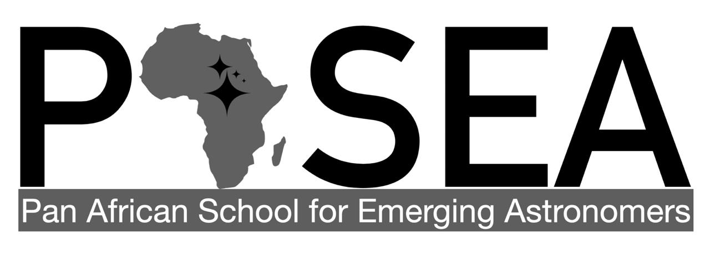

# PASEA 2022
A collection of Python learning notebooks for the PASEA 2022 Summer School in Livingstone, Zambia.

 This work is licensed under a <a rel="license" href="http://creativecommons.org/licenses/by-nc-sa/4.0/">Creative Commons Attribution-NonCommercial-ShareAlike 4.0 International License</a>.

Some of these notebooks are modifications of the interactive tutorials at https://prappleizer.github.io/index.html by Imad Pasha (2019). The _Contributing to Astropy_ workshop is an adaptation of the workshop at https://github.com/astropy/astropy-workshop. We opened the [Pull Request 13823](https://github.com/astropy/astropy/pull/13823) in Astropy as a result of this workshop.

## References
Imad Pasha. (2019). prappleizer/prappleizer.github.io: Release 1: New website, same texbook (1.0). Zenodo. https://doi.org/10.5281/zenodo.3459861